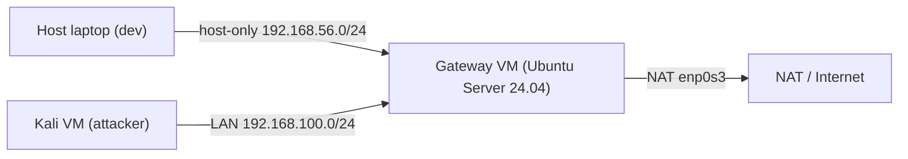

# GWMON — Gateway Traffic Monitoring & Threat Detection

**Author:** Agoci Roberto-Georgian
**Faculty:** Automation and Computers, Politehnica University of Timișoara
**Study program:** Computers and Information Technology in English (Bachelor)

GWMON is a self-hosted web application that combines **network traffic
visibility**, **signature-based intrusion detection** and **active
access-control enforcement** into a single operator interface. It ingests
**NetFlow** records from an Ubuntu gateway and stores per-minute aggregates
in **InfluxDB**; it consumes **Suricata** IDS alerts and stores them in
**PostgreSQL**; and it drives a small **firewall-agent** on the gateway
that installs and removes `iptables` rules on demand or in response to
detected threats.

The web interface offers:

- A live **Dashboard** with KPI cards, a traffic-over-time chart, protocol
  distribution and top-talker tables.
- A paginated **Flows** explorer with per-protocol, per-IP, per-port and
  direction filters.
- A live **Alerts** page with severity filters, top signatures, infinite
  pagination and 5-second polling.
- An **Access Rules** page for manual and automatic IP blocking, active
  rules, rule history, audit log and trusted-IPs list, with a hard safety
  guard that refuses to block critical infrastructure addresses.
- **JWT-based authentication** and a **PDF export** of the dashboard.

### Two testing modes

GWMON is a network-monitoring application, so its intended and
complete usage mode requires the full lab. A shorter build-only path
is documented on top of it for users who want a quick sanity check
before investing in the VMs.

- **Primary — full end-to-end lab (Gateway VM + Kali VM + gateway
  services).** This is how the application is designed to be run.
  Follow Section 8 to build the two VMs and deploy the three
  gateway-side services from `gateway/`, then generate traffic and
  attacks from the Kali VM (Section 9.2.2). Only in this mode do
  softflowd, Suricata and the ingestion services produce real data,
  the Dashboard / Flows / Alerts pages fill with live records, and
  the Access Rules page reacts to real IDS events (including the
  automatic-block worker).

- **Optional smoke test — application only (host laptop, no lab).**
  Build the backend and frontend as described in Sections 5–7, then
  start them as in Section 9. This confirms that the application
  **compiles and starts without errors**, that the UI renders, that
  authentication (register / login / logout) works, that all four
  pages (Dashboard, Flows, Alerts, Access Rules) load, and that the
  OpenAPI documentation is served on `/docs`. Data-driven widgets
  stay empty because no NetFlow records or IDS alerts are being
  produced — this mode is a fast sanity check only, not a functional
  test of the project.

This README is written so that a user can reproduce the entire
end-to-end setup — VMs, gateway services, backend, frontend — starting
from a clean laptop.

---

## 1. Repository

- Source code (source only — compiled binaries, virtualenvs, `node_modules/`,
  logs and secrets are excluded via `.gitignore`):

  **<https://github.com/Agok28/GWMON>**

> **Important:** the repository visibility is set to **public**, so
> the link above can be opened without any additional access.

The repository is a **monorepo** with three source-code groups — the
FastAPI backend, the React SPA frontend, and the gateway-side services
that must be deployed on the Ubuntu Gateway VM:

```
GWMON/
├── backend/                          # Python 3.11+ FastAPI REST API (host laptop)
│   ├── app/
│   ├── requirements.txt
│   └── .env.example
├── frontend/                         # React 19 + TypeScript SPA (host laptop, Vite)
│   ├── src/
│   ├── package.json
│   └── vite.config.ts
├── gateway/                          # Gateway-side source code (Ubuntu Server VM)
│   ├── ingest/                       # NetFlow -> InfluxDB
│   │   ├── __init__.py
│   │   ├── service.py
│   │   ├── requirements.txt
│   │   ├── gwmon.yaml.example
│   │   └── gwmon-ingest.service
│   ├── suricata-ingest/              # Suricata eve.json -> PostgreSQL
│   │   ├── suricata_ingest.py
│   │   └── requirements.txt
│   └── firewall-agent/               # FastAPI wrapper for iptables (port 8090)
│       ├── agent.py
│       ├── requirements.txt
│       └── gwmon-firewall-agent.service
├── .gitignore
└── README.md
```

> **Note on `gateway/`:** these files are **part of the source code** of
> the project. They are not part of the FastAPI backend that runs on the
> host laptop; they must be **copied to and deployed on the Ubuntu Gateway
> VM** as described in Section 8.

---

## 2. Lab Architecture

GWMON is a multi-VM lab that assumes an **Oracle VirtualBox** host with
two virtual machines and the developer's laptop:



- **Host laptop** runs the FastAPI backend (port 8000) and the React SPA
  (Vite dev server, port 5173) during development.
- **Gateway VM** routes traffic between Kali, the host-only network and
  the Internet, and hosts `softflowd`, `nfcapd`, **Suricata**, the three
  services from `gateway/` (NetFlow ingest, Suricata ingest,
  firewall-agent on port 8090) and enforces `iptables` rules.
- **Kali VM** is the attacker/traffic generator (nmap, hping3, curl, ab).
- **PostgreSQL** and **InfluxDB** are used by the backend to persist
  alerts, firewall state and per-minute traffic metrics.

**IP addressing plan:**

| Host           | Interface                | IPv4 Address       | Role                   |
|----------------|--------------------------|--------------------|------------------------|
| Gateway VM     | `enp0s3` (NAT)           | assigned by NAT    | Outbound NAT / WAN     |
| Gateway VM     | `enp0s8` (Internal)      | `192.168.100.1`    | Default gateway (LAN)  |
| Gateway VM     | `enp0s9` (Host-only)     | `192.168.56.101`   | Management + agent     |
| Kali VM        | `eth0` (Internal)        | `192.168.100.10`   | Attacker (LAN)         |
| Host laptop    | Host-only adapter        | `192.168.56.1`     | Backend + DB clients   |

---

## 3. Technology Stack

| Layer                | Technology                                                     |
|----------------------|----------------------------------------------------------------|
| Frontend             | **React 19** + **TypeScript**, bundled with **Vite**           |
| Frontend libraries   | React Router, Axios, Recharts, jsPDF + jspdf-autotable, date-fns |
| Backend / API        | **Python 3.11+** with **FastAPI** on **Uvicorn**               |
| Backend libraries    | SQLAlchemy 2.x, Pydantic v2, passlib[bcrypt], python-jose, httpx, influxdb-client |
| Relational database  | **PostgreSQL** 14+                                             |
| Time-series database | **InfluxDB 2.7** (Docker)                                      |
| Authentication       | **JSON Web Tokens** (HS256)                                    |
| Flow monitoring      | **softflowd** (NetFlow v5 exporter) + **nfcapd** / **nfdump**  |
| IDS engine           | **Suricata 7.0.3** with Emerging Threats Open ruleset          |
| Firewall enforcement | **Linux iptables** (INPUT + FORWARD DROP rules) via `sudo`     |
| Gateway agent        | Small **FastAPI** service listening on port 8090 (token-authed) |
| Virtualisation       | **Oracle VirtualBox 7**                                        |
| Gateway OS           | **Ubuntu Server 24.04 LTS**                                    |
| Attacker OS          | **Kali Linux** (rolling)                                       |

---

## 4. Prerequisites

Prerequisites are split by mode so you only install what you need.

### 4.1 To build and start the application (mandatory)

On the host laptop:

- **Node.js** ≥ 20 and **npm** ≥ 10 — <https://nodejs.org>
- **Python** ≥ 3.11 and **pip** — <https://www.python.org/downloads/>
- **git** — to clone the repository.

Verify local versions:

```bash
node -v
npm -v
python --version
git --version
```

With just these you can complete Sections 5–7 and 9 to confirm that the
backend, the frontend and the authentication layer come up correctly.
Data pages will be empty until the lab is running.

### 4.2 To reproduce the full end-to-end lab (optional)

In addition to the above, you will need:

- **Oracle VirtualBox 7+** on the host laptop — <https://www.virtualbox.org>
- **Ubuntu Server 24.04 LTS** ISO — <https://ubuntu.com/download/server>
- **Kali Linux** ISO — <https://www.kali.org/get-kali/>
- On the gateway VM: **Docker Engine** (for InfluxDB) and **PostgreSQL**
  server packages.

These are only required if you follow Section 8 and want to see real
traffic and IDS alerts inside the application.

---

## 5. Getting the Source Code

```bash
git clone https://github.com/Agok28/GWMON.git
cd GWMON
```

---

## 6. Environment Variables

The backend reads its configuration from a `.env` file that is **not**
committed to the repository (it is listed in `.gitignore`). Create
`backend/.env` from the template provided (`backend/.env.example`) and
fill in your own values — **never commit real secrets**.

**`backend/.env`**

```env
# --- InfluxDB (time-series metrics) ---
INFLUXDB_URL=http://<GATEWAY_IP>:8086
INFLUXDB_TOKEN=<your-influxdb-token>
INFLUXDB_ORG=gwmon
INFLUXDB_BUCKET=traffic

# --- PostgreSQL (users, alerts, firewall state) ---
DATABASE_URL=postgresql://<POSTGRES_USER>:<POSTGRES_PASSWORD>@<POSTGRES_HOST>:5432/<POSTGRES_DB>

# --- FastAPI HTTP layer ---
CORS_ORIGINS=["http://localhost:5173"]

# --- Authentication (JWT signing) ---
JWT_SECRET=<generate-a-long-random-string>

# --- Firewall agent (gateway VM) ---
GATEWAY_FIREWALL_URL=http://192.168.56.101:8090
GATEWAY_FIREWALL_TOKEN=<same-token-as-firewall-agent>

# --- Background worker (auto-block + rule expiration) ---
FIREWALL_WORKER_ENABLED=true
FIREWALL_WORKER_INTERVAL_SECONDS=30
```

The frontend does not need its own `.env` file: Vite's dev proxy in
`frontend/vite.config.ts` forwards `/auth`, `/traffic`, `/alerts`,
`/firewall` and `/health` to the FastAPI backend on
`http://localhost:8000`.

Gateway-side services have their own configuration surface (a YAML
config for the NetFlow ingest service, environment variables for the
Suricata ingest and firewall agent). See Section 8 for the deployment
details.

---

## 7. Build Steps

Install dependencies for both applications on the host laptop. All
commands below start from the repository root (`GWMON/`).

**Backend**

The Python virtual environment lives at the **repository root**
(`GWMON/.venv/`); dependencies are installed from
`backend/requirements.txt`.

```bash
# From the repository root (GWMON/)
python -m venv .venv

# Activate the venv
# Windows PowerShell:
.\.venv\Scripts\Activate.ps1
# Linux / macOS:
source .venv/bin/activate

# Install backend dependencies (requirements.txt lives in backend/)
pip install -r backend/requirements.txt
```

> The FastAPI backend is plain Python; it does not require a separate
> build step. Uvicorn compiles and serves the code on demand.
>
> The `.venv/` directory is excluded by `.gitignore`, so it will never
> be committed.

**Frontend**

```bash
# From the repository root (GWMON/)
cd frontend
npm install
npm run build      # produces the optimised production bundle in frontend/dist
```

> `npm run build` runs the TypeScript compiler (`tsc -b`) and then Vite,
> so no separate TypeScript build step is required.

---

## 8. Lab Setup (Gateway VM + Kali VM + Gateway Services)

> This section describes the **complete runtime environment** for
> GWMON: two VirtualBox VMs plus the three gateway-side services from
> `gateway/`. Complete Section 8 in full to exercise NetFlow ingest,
> the Suricata IDS pipeline and the firewall-agent end-to-end.
>
> A shorter host-only path (Sections 5–7 and 9 alone) is documented
> as an optional smoke test — the application will build and start
> without the lab, but every data-driven page (Dashboard, Flows,
> Alerts, Access Rules) will remain empty until the VMs are running.

### 8.1 Gateway VM — Ubuntu Server 24.04

1. In VirtualBox, create a new VM with **3 network adapters**:
   - Adapter 1: **NAT** (WAN, becomes `enp0s3`).
   - Adapter 2: **Internal Network** named e.g. `gwmon-lan` (LAN, becomes
     `enp0s8`).
   - Adapter 3: **Host-only Adapter** (management, becomes `enp0s9`).
2. Install **Ubuntu Server 24.04 LTS** with default options.
3. Configure static addresses via netplan
   (`/etc/netplan/01-gwmon.yaml`, run `sudo netplan apply`):

   ```yaml
   network:
     version: 2
     ethernets:
       enp0s3:
         dhcp4: true
       enp0s8:
         addresses: [192.168.100.1/24]
       enp0s9:
         addresses: [192.168.56.101/24]
   ```

4. Enable **IP forwarding** and **NAT MASQUERADE**:

   ```bash
   echo 'net.ipv4.ip_forward = 1' | sudo tee /etc/sysctl.d/99-gwmon.conf
   sudo sysctl --system
   sudo iptables -t nat -A POSTROUTING -o enp0s3 -j MASQUERADE
   sudo apt install -y netfilter-persistent iptables-persistent
   sudo netfilter-persistent save
   ```

### 8.2 Traffic monitoring — softflowd + nfcapd

Install the tools on the gateway:

```bash
sudo apt install -y softflowd nfdump
sudo mkdir -p /var/log/netflow
```

Create `/etc/systemd/system/softflowd.service`:

```ini
[Unit]
Description=softflowd NetFlow v5 exporter
After=network.target

[Service]
Type=forking
ExecStart=/usr/sbin/softflowd -d -i enp0s8 -n 127.0.0.1:2055 -v 5 -t maxlife=60 -t expint=60
Restart=on-failure

[Install]
WantedBy=multi-user.target
```

Create `/etc/systemd/system/nfcapd.service`:

```ini
[Unit]
Description=nfcapd NetFlow collector (UDP 2055 -> /var/log/netflow)
After=network.target

[Service]
Type=simple
ExecStart=/usr/bin/nfcapd -w -D -l /var/log/netflow -p 2055
Restart=on-failure

[Install]
WantedBy=multi-user.target
```

Enable and start both:

```bash
sudo systemctl daemon-reload
sudo systemctl enable --now softflowd nfcapd
```

### 8.3 NetFlow ingest service — `gateway/ingest/`

This service is **part of the repository** (`gateway/ingest/service.py`).
It periodically reads the `nfcapd` files from `/var/log/netflow`,
converts them to JSON using `nfdump -o json`, and writes two
measurements to InfluxDB:

- `flow` — one point per raw NetFlow record (src/dst IP, ports, proto,
  bytes, packets).
- `traffic_minute` — per-minute rollups (`bytes_sum`, `packets_sum`,
  `flows_count`), used by the Dashboard chart.

**Deployment on the Gateway VM:**

```bash
# Create a system user and the target directory
sudo useradd -r -s /usr/sbin/nologin gwmon || true
sudo mkdir -p /opt/gwmon/gwmon/ingest /opt/gwmon/config

# Copy the source code from the cloned repository
sudo cp gateway/ingest/service.py     /opt/gwmon/gwmon/ingest/service.py
sudo cp gateway/ingest/__init__.py    /opt/gwmon/gwmon/ingest/__init__.py
sudo touch                            /opt/gwmon/gwmon/__init__.py

# Create the config from the example and edit it
sudo cp gateway/ingest/gwmon.yaml.example /opt/gwmon/config/gwmon.yaml
sudoedit /opt/gwmon/config/gwmon.yaml   # fill in real InfluxDB token

# Create a virtualenv with the required libraries
sudo python3 -m venv /opt/gwmon/.venv
sudo /opt/gwmon/.venv/bin/pip install -r gateway/ingest/requirements.txt

# Install the systemd unit
sudo cp gateway/ingest/gwmon-ingest.service /etc/systemd/system/
sudo systemctl daemon-reload
sudo systemctl enable --now gwmon-ingest
```

Once running, verify with:

```bash
sudo systemctl status gwmon-ingest
sudo journalctl -u gwmon-ingest -f
```

### 8.4 IDS — Suricata

```bash
sudo apt install -y suricata
sudo suricata-update
```

In `/etc/suricata/suricata.yaml`, ensure that:

- `af-packet` is bound to `enp0s8`,
- `eve.json` output is enabled at `/var/log/suricata/eve.json`,
- the Emerging Threats Open ruleset is loaded.

Minimal snippet (the file already contains most of it — verify the
values match):

```yaml
af-packet:
  - interface: enp0s8
    cluster-id: 99
    cluster-type: cluster_flow
    defrag: yes

outputs:
  - eve-log:
      enabled: yes
      filetype: regular
      filename: /var/log/suricata/eve.json
      types:
        - alert
        - anomaly

default-rule-path: /var/lib/suricata/rules
rule-files:
  - suricata.rules
```

Then:

```bash
sudo systemctl enable --now suricata
sudo suricata -T -c /etc/suricata/suricata.yaml -v   # config test
```

### 8.5 Suricata ingest service — `gateway/suricata-ingest/`

This service is **part of the repository**
(`gateway/suricata-ingest/suricata_ingest.py`). It tails
`/var/log/suricata/eve.json` and inserts every event of type `alert`
into the PostgreSQL table `ids_alerts` used by the FastAPI backend.

**Database credentials are read from environment variables — never
hardcode them in the file.** Configure the service through a systemd
`EnvironmentFile` (`/etc/gwmon/suricata-ingest.env`).

**Deployment on the Gateway VM:**

```bash
sudo mkdir -p /opt/gwmon
sudo cp gateway/suricata-ingest/suricata_ingest.py /opt/gwmon/

sudo /opt/gwmon/.venv/bin/pip install -r gateway/suricata-ingest/requirements.txt

sudo mkdir -p /etc/gwmon
sudo tee /etc/gwmon/suricata-ingest.env > /dev/null <<'EOF'
POSTGRES_HOST=192.168.56.1
POSTGRES_PORT=5432
POSTGRES_DB=gwmon
POSTGRES_USER=gwmon
POSTGRES_PASSWORD=<REPLACE_ME>
SURICATA_EVE_PATH=/var/log/suricata/eve.json
EOF
sudo chmod 600 /etc/gwmon/suricata-ingest.env

# Create the systemd unit
sudo tee /etc/systemd/system/gwmon-suricata-ingest.service > /dev/null <<'EOF'
[Unit]
Description=GWMON Suricata eve.json ingester
After=network.target postgresql.service suricata.service

[Service]
Type=simple
EnvironmentFile=/etc/gwmon/suricata-ingest.env
ExecStart=/opt/gwmon/.venv/bin/python /opt/gwmon/suricata_ingest.py
Restart=on-failure

[Install]
WantedBy=multi-user.target
EOF

sudo systemctl daemon-reload
sudo systemctl enable --now gwmon-suricata-ingest
```

### 8.6 PostgreSQL

```bash
sudo apt install -y postgresql
sudo -u postgres psql <<'SQL'
CREATE USER gwmon WITH ENCRYPTED PASSWORD '<REPLACE_ME>';
CREATE DATABASE gwmon OWNER gwmon;
GRANT ALL PRIVILEGES ON DATABASE gwmon TO gwmon;
SQL
```

Update `DATABASE_URL` in `backend/.env` and `POSTGRES_PASSWORD` in
`/etc/gwmon/suricata-ingest.env` to match the password you chose.

The backend creates all tables it needs on first start-up through
SQLAlchemy (`users`, `ids_alerts`, `firewall_rules`, `firewall_settings`,
`firewall_audit_log`, `trusted_ips`), so no manual schema step is
needed.

**Remote access (only if PostgreSQL is not local to every consumer).**
If PostgreSQL runs on the host laptop (`POSTGRES_HOST=192.168.56.1`)
but the Suricata-ingest service connects from the Gateway VM
(`192.168.56.101`), the default PostgreSQL install rejects the
connection. On the machine hosting PostgreSQL, allow the host-only
subnet:

```bash
# 1. Allow the server to listen on all interfaces
#    Linux:   /etc/postgresql/16/main/postgresql.conf
#    Windows: C:\Program Files\PostgreSQL\16\data\postgresql.conf
#    -> listen_addresses = '*'

# 2. Trust the host-only subnet in pg_hba.conf (same folder)
#    Add this line before the default 'host all all 127.0.0.1/32' line:
#    host    gwmon    gwmon    192.168.56.0/24    scram-sha-256

# 3. Reload PostgreSQL
sudo systemctl reload postgresql          # Linux
# Restart-Service postgresql-x64-16       # Windows PowerShell (admin)
```

### 8.7 InfluxDB 2.7 (Docker)

Run InfluxDB as a container on the gateway (or on the host laptop):

```bash
docker run -d --name influxdb \
  -p 8086:8086 \
  -v influxdb-data:/var/lib/influxdb2 \
  influxdb:2.7
```

Then open <http://localhost:8086>, complete the initial setup and take
note of:

- **Organisation:** `gwmon`
- **Initial bucket:** `traffic`
- The generated **API token** — copy this into:
  - `INFLUXDB_TOKEN` in `backend/.env`
  - `influxdb.token` in `/opt/gwmon/config/gwmon.yaml`

### 8.8 Firewall agent — `gateway/firewall-agent/`

The firewall agent is **part of the repository**
(`gateway/firewall-agent/agent.py`). It is a small **FastAPI service**
that runs on the gateway VM and is the **only** component allowed to
touch `iptables`.

- Listens on **`0.0.0.0:8090`** (reachable from the host laptop through
  the host-only network at `192.168.56.101:8090`).
- Requires a shared token in the JSON body of each write request,
  matching `GATEWAY_FIREWALL_TOKEN` in `backend/.env` and
  `FIREWALL_API_TOKEN` in the agent's systemd environment.
- Endpoints:
  - `GET  /health`  — liveness probe.
  - `POST /block`   — installs DROP rules on `INPUT` and `FORWARD`.
  - `POST /unblock` — removes the corresponding DROP rules.

**Deployment on the Gateway VM:**

```bash
sudo mkdir -p /opt/gwmon/firewall-agent
sudo cp gateway/firewall-agent/agent.py /opt/gwmon/firewall-agent/

# Dedicated virtualenv
sudo python3 -m venv /opt/gwmon/firewall-agent/venv
sudo /opt/gwmon/firewall-agent/venv/bin/pip install \
    -r gateway/firewall-agent/requirements.txt

# Copy the systemd unit and edit it: set User= to the account that has
# passwordless sudo for iptables, and set FIREWALL_API_TOKEN to a real
# long random string (also copy it into backend/.env as
# GATEWAY_FIREWALL_TOKEN).
sudo cp gateway/firewall-agent/gwmon-firewall-agent.service \
        /etc/systemd/system/
sudoedit /etc/systemd/system/gwmon-firewall-agent.service

# The chosen user needs to run iptables via sudo without a password.
# Example line for /etc/sudoers.d/gwmon-firewall:
#   ragoci ALL=(ALL) NOPASSWD: /sbin/iptables

sudo systemctl daemon-reload
sudo systemctl enable --now gwmon-firewall-agent
```

Verify from the host laptop:

```bash
curl http://192.168.56.101:8090/health
# -> {"status":"ok"}
```

### 8.9 Kali VM — attacker / traffic generator

1. In VirtualBox, create a Kali Linux VM with **one adapter** attached
   to the same Internal Network as the gateway LAN (`gwmon-lan`).
2. Configure Kali's IPv4 statically. Recent Kali releases use
   NetworkManager, so `nmcli` is the fastest option:

   ```bash
   # On Kali VM (identify the connection name first with `nmcli con show`)
   sudo nmcli con mod "Wired connection 1" ipv4.method manual \
       ipv4.addresses 192.168.100.10/24 \
       ipv4.gateway  192.168.100.1 \
       ipv4.dns      "8.8.8.8"
   sudo nmcli con up "Wired connection 1"

   # Verify
   ip -4 addr show; ip route; ping -c 3 192.168.100.1
   ```

3. Tools used during validation:
   - `ping` (baseline reachability).
   - `nmap` (port + service scans that trigger Suricata signatures).
   - `curl` (HTTP requests, User-Agent spoofing).
   - `ab` (Apache Bench) or an equivalent HTTP load generator.

### 8.10 Time synchronization (all hosts)

The Dashboard's traffic chart and the Alerts page display timestamps
that come from three independent clocks — the host laptop (backend
receives requests), the Gateway VM (softflowd + Suricata timestamps)
and the Kali VM (attack origin). If these drift by more than a few
seconds, freshly generated flows and alerts may look "old" or fail
to appear in the last-15-minutes view.

Enable NTP on every VM:

```bash
# On Gateway VM and Kali VM
sudo timedatectl set-ntp true
timedatectl status         # "System clock synchronized: yes"
```

On the host laptop, make sure Windows/macOS "Set time automatically"
is enabled and the timezone matches the VMs (or leave every host in
UTC).

---

## 9. Installation & Launch (Development mode)

Once the lab is running (Section 8), start the backend and the frontend
on the host laptop in **two separate terminals**.

**Terminal 1 — FastAPI backend**

```bash
# From the repository root (GWMON/)
# 1. Activate the venv created in Section 7
# Windows PowerShell:
.\.venv\Scripts\Activate.ps1
# Linux / macOS:
source .venv/bin/activate

# 2. Change into the backend folder (where app.main lives)
cd backend

# 3. Start uvicorn
uvicorn app.main:app --host 0.0.0.0 --port 8000 --reload
```

The API is now available on <http://localhost:8000> and its interactive
OpenAPI documentation on <http://localhost:8000/docs>.

**Terminal 2 — React frontend (Vite dev server)**

```bash
# From the repository root (GWMON/)
cd frontend
npm install          # first time only
npm run dev          # serves the SPA on http://localhost:5173
```

Open the application in your browser at <http://localhost:5173>,
register the first user through the **Register** page and log in.

### 9.1 Production build (optional)

```bash
cd frontend
npm run build        # output in frontend/dist
```

Serve `frontend/dist` with any static web server (e.g. `npm run preview`
or Nginx) and run the backend behind a production ASGI server
(`uvicorn` with `--workers` > 1, or `gunicorn -k uvicorn.workers.UvicornWorker`).

### 9.2 Testing the application

#### 9.2.1 Without the lab (application-only smoke test)

If you have skipped Section 8, the application should still show:

- The **login** and **register** pages, with full form validation and
  correct error handling for wrong credentials.
- After registering the first user and logging in, all four protected
  pages (Dashboard, Flows, Alerts, Access Rules) render without errors.
- The **Access Rules** page shows a red "Gateway agent unreachable"
  indicator — expected, because the agent is not running.
- The FastAPI OpenAPI documentation on <http://localhost:8000/docs>
  lists every endpoint and lets you invoke `/auth/register`,
  `/auth/login` and `/auth/me` interactively.

Data-driven widgets (traffic KPIs, protocol distribution, alerts table)
will be empty. This is the expected behaviour when no NetFlow records
or Suricata alerts are being produced.

#### 9.2.2 With the lab — generating traffic and attacks from Kali

To see real data flowing through the application you need to generate
traffic and attacks **from the Kali VM**, so that softflowd exports
NetFlow records and Suricata triggers signatures.

**Baseline traffic** (populates the Dashboard KPIs and the Flows page):

```bash
# On Kali VM
ping -c 100 8.8.8.8                        # sustained ICMP flow
curl -o /dev/null https://speed.hetzner.de/100MB.bin   # HTTP download
ab -n 500 -c 10 http://<a-lab-web-target>/ # HTTP benchmark
```

**IDS alerts** (populate the Alerts page with ET SCAN signatures):

```bash
# On Kali VM
nmap -sS 192.168.100.1                     # SYN scan of the gateway
nmap -sV 192.168.100.1                     # service/version scan
nmap -sV -p 1-1000 192.168.56.101          # scan the management IP
curl -A "Nmap Scripting Engine" http://192.168.100.1/  # user-agent signature
```

**Automatic blocking** (populates Access Rules with an AUTOMATIC entry):

1. On the Access Rules page, enable **Auto Block** with a low threshold
   (e.g. 10 hits in 5 minutes) and a block duration of 10 minutes.
2. From Kali, run an aggressive scan such as
   `nmap -sS -p 1-10000 192.168.100.1` which produces many ET SCAN
   alerts within a minute.
3. Within one worker cycle (~30 seconds) an AUTO rule appears in the
   Active Rules table and the Kali VM loses connectivity.

**Trusted-IP safety** (validates the safety guard):

- From the Access Rules page, try to manually block `192.168.100.1`,
  `192.168.56.101`, `192.168.56.1` or `127.0.0.1`. Each attempt is
  refused with `HTTP 400 — trusted IP` and logged in the Audit Log
  panel with `action=BLOCK_REJECTED`, `status=TRUSTED`.

---

## 10. Verifying the Installation

A working installation shows the following after login:

- **Dashboard:** non-zero *Total flows / packets / bytes* KPI cards
  once Kali starts sending traffic.
- **Flows:** a paginated list of NetFlow records with direction badges
  (Inbound / Outbound / Internal / External).
- **Alerts:** rows appearing within 5–10 seconds after running an
  `nmap` scan from Kali; clicking a row opens the raw `eve.json` event.
- **Access Rules:** the "Gateway agent reachable" indicator is green
  and manual block/unblock actions succeed; blocking `192.168.100.1`
  (LAN gateway) is refused with `HTTP 400 — trusted IP`.
- **Export PDF** on the Dashboard downloads a report containing the
  traffic summary, protocol distribution, IDS alerts summary and top
  signatures.

If any of these fail, check the corresponding service:

| Symptom                                | Where to look                                                     |
|----------------------------------------|-------------------------------------------------------------------|
| Dashboard shows zero traffic           | `sudo systemctl status softflowd nfcapd gwmon-ingest`             |
| Alerts page never fills                | `sudo journalctl -u suricata -u gwmon-suricata-ingest -f`         |
| "Gateway agent unreachable" banner     | `sudo systemctl status gwmon-firewall-agent`, then `curl 192.168.56.101:8090/health` |
| HTTP 502 when trying to block an IP    | Check the firewall-agent journal for iptables errors              |

---

## 11. Security Notes

The gateway-side services in the original lab used **hardcoded
credentials**. In the repository version these have been replaced with
**environment variables** or **placeholders** (e.g. `<FIREWALL_API_TOKEN>`,
`<POSTGRES_PASSWORD>`, `<YOUR_INFLUXDB_TOKEN>`). Before running any of
them you must configure:

1. **InfluxDB** — `INFLUXDB_URL`, `INFLUXDB_ORG`, `INFLUXDB_BUCKET` and
   `INFLUXDB_TOKEN`. Backend reads them from `backend/.env`; the ingest
   service reads them from `/opt/gwmon/config/gwmon.yaml`, created from
   `gateway/ingest/gwmon.yaml.example`.
2. **PostgreSQL** — host, port, database, user, password. Backend reads
   them (as a single `DATABASE_URL`) from `backend/.env`; the Suricata
   ingest reads them as separate variables from
   `/etc/gwmon/suricata-ingest.env`.
3. **Firewall agent API token** — `FIREWALL_API_TOKEN` in the agent's
   systemd unit, which must match `GATEWAY_FIREWALL_TOKEN` in
   `backend/.env`.

**Never commit real tokens or passwords.** All secrets stay in local
files that are excluded by `.gitignore` (`.env`, real
`/opt/gwmon/config/gwmon.yaml`) or in files that live only on the
gateway (`/etc/gwmon/*.env`, `/etc/systemd/system/*.service`).

Recommended token strength: at least 32 random bytes,
Base64-URL-encoded (`openssl rand -base64 32`).

---

## 12. Repository Contents / Notes

- The repository contains **source code only**. The following are **not
  committed** and are regenerated locally:
  - `backend/.venv/`, `gateway/**/venv/`
  - `frontend/node_modules/`, `frontend/dist/`, `.vite/`
  - `__pycache__/`, `*.pyc`, `*.pyo`
  - `backend/.env` and any real `gwmon.yaml` with a token
  - `*.log`, systemd journal files and other run-time logs
- The backend automatically creates the PostgreSQL tables it needs on
  the first start-up; no manual `CREATE TABLE` step is required.
- The three services under `gateway/` are **part of the source code of
  the project** but they are not part of the FastAPI backend that lives
  in `backend/`. They must be **copied to and deployed on the Ubuntu
  Gateway VM** as documented in Sections 8.3, 8.5 and 8.8.
- All URLs, ports and IP addresses used above match the placeholders in
  `backend/.env.example` and `gateway/ingest/gwmon.yaml.example`; if you
  change any of them, update the corresponding variables before starting
  the services.
